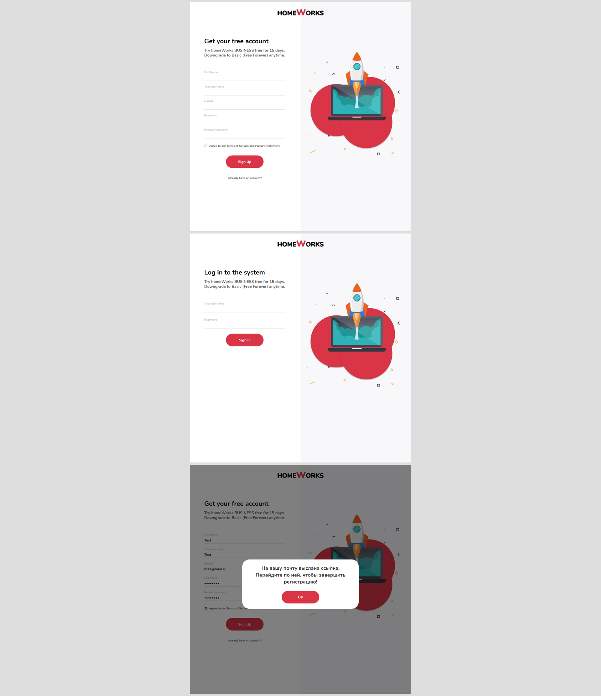

# Страница регистрации аккаунта

Вёрстка страницы для регистрации и авторизации пользователя  
**Год:** 2022

## Внешний вид

## Реализовано:
- Вёрстка веб-страницы регистрации и авторизации по макету;
- Реализация функционала (обработка событий, изменение атрибутов html-элементов, изменения структуры DOM-элементов, валидация) с помощью JavaScript;

## Используемые технологии:
* HTML
* CSS
* JavaScript